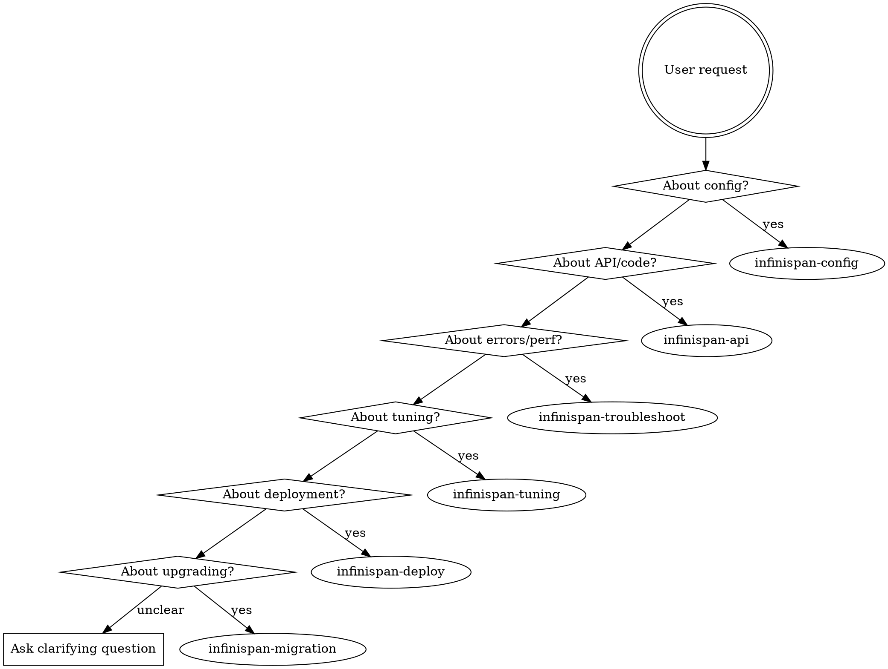

# Infinispan Skill Suite

Infinispan is an open-source, in-memory distributed data grid and cache. This skill routes to specialized sub-skills based on user intent.

## Intent Classification

Read the user's request and route to the appropriate sub-skill:

## Routing Table

| Intent | Sub-skill | Signals |
|--------|-----------|---------|
| Configuration | `infinispan-config` | Cache modes, XML/YAML config, persistence, indexing, encoding, security, clustering, cross-site replication |
| API & Code | `infinispan-api` | Embedded mode, Hot Rod client, REST client, Ickle queries, counters, transactions, Spring/Quarkus |
| Troubleshooting | `infinispan-troubleshoot` | Errors (ISPN/JGRP codes), exceptions, cluster problems, serialization failures, Hot Rod connectivity, log analysis |
| Tuning | `infinispan-tuning` | Performance, latency, throughput, GC pressure, heap sizing, capacity planning, monitoring metrics |
| Deployment | `infinispan-deploy` | Operator, Helm, Kubernetes, container images, scaling, monitoring |
| Migration | `infinispan-migration` | Version upgrades, deprecated features, config format conversion, store migration, embedded-to-server |

## Do NOT Trigger For

- Generic caching questions not about Infinispan (Redis standalone, Ehcache, Hazelcast)
- Unrelated code with no Infinispan references

## Cross-cutting

- Link to official docs at `https://infinispan.org/docs/` when relevant
- Default to latest Infinispan version (16.x) unless user specifies otherwise
- Suggest MCP server connection (`-Dorg.infinispan.feature.mcp=true`) when live inspection would help troubleshooting